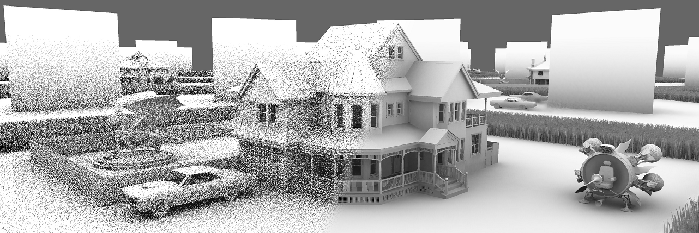

# D3D12 Raytracing Ambient Occlusion sample

This sample demonstrates how to implement a Denoised Raytraced Ambient Occlusion in Real-Time. The sample assumes familiarity with Dx12 programming and DirectX Raytracing concepts introduced in the [D3D12 Raytracing Procedural Geometry sample](../D3D12RaytracingDProceduralGeometry/readme.md).

ToDo... 
- Renamte to D3D12RaytracingRealTimeDenoisedRaytracedAmbientOcclusion
- Capitatlization
- links to code

## Usage
ToDo

D3D12RaytracingAmbientOcclusion.exe [...]
  * [-forceAdapter \<ID>] - create a D3D12 device on an adapter <ID>. Defaults to adapter 0.

### UI
The title bar of the sample provides runtime information:
* Name of the sample
* Frames per second
* Million Primary Rays/s: a number of dispatched rays per second calculated based of FPS.
* GPU[ID]: name

### Controls
* ALT+ENTER - toggles between windowed and fullscreen modes.
* L - enable/disable light animation.
* C - enable/disable camera animation.
* ESC - terminate the application.
* Hold left mouse key and drag - rotate camera's focus at position.
* Hold right mouse key and drag - rotate scene.
* 
## Requirements
* Requires DXR capable HW and SW. Consult the main [D3D12 Raytracing readme](../../readme.md) for requirements. The sample doesn't implement Raytracing Fallback Layer path.

## Acknowledgements
* The grass straw generation is based on Emerald Engine implementation https://github.com/lragnarsson/Emerald-Engine
* The sample uses following 3rd party assets:
  * A pbrt-v3 version of 'Victoryan Style House' by MrChimp2313, downloaded from https://benedikt-bitterli.me/resources/, released under a [CC0 license](https://creativecommons.org/publicdomain/zero/1.0/).
  * A pbrt-v3 version of 'Pontiac GTO 67' by thecali, downloaded from https://benedikt-bitterli.me/resources/, released under a [CC0 license](https://creativecommons.org/publicdomain/zero/1.0/).
  * A pbrt-v3 version of 'Dragon' by Delatronic, downloaded from https://benedikt-bitterli.me/resources/, released under a [CC-BY license](https://creativecommons.org/licenses/by/3.0/).
  * A pbrt-v3 version of '4060.b Spaceship' by thecali, downloaded from https://benedikt-bitterli.me/resources/, released under a [CC0 license](https://creativecommons.org/publicdomain/zero/1.0/).
  * An environment map 'Flower Road', downloaded from https://hdrihaven.com/hdri/?c=outdoor&h=flower_road, released under a [CCO license](https://creativecommons.org/publicdomain/zero/1.0/).

See the sideloaded License.txt next to each asset for further license information.

# Pathracer

# Raytraced Ambient Occlusion (RTAO)

## Denoiser
### Temporal Reprojection

# Scene
The scene was designed in a way to test the RTAO and denoiser implementations:
* Large number of triangles: 
  * ...
* Multiple BLAS instances
* Reflective & transmissive surfaces
* Dynamic geometry
  * Objects with dynamic BLAS instance transforms
  * Objects with dynamic vertex geometry 
    * Grass patches
* High-frequency geometry

## Dynamic geometry
The sample supports dynamic updates both to BLAS world transforms and geometry vertices. TLAS is rebuilt every frame picking up active BLAS instances with updated world transforms. BLASes that have had their vertex geometry changed are rebuilt.

### Dynamic Vertex Geometry
The grass patches are the only objects with dynamic vertex geometry in the scene. They are built as patches of grass blades, i.e. 100x100 grass blades, with each blade consisting of 5 triangles generated via a Compute Shader ([GenerateGrassStrawsCS.hlsl](util/GenerateGrassStrawsCS.hlsl)) based on input parameters and a wind map texture. The blade generation is based on [Emerald's engine implementation](https://github.com/lragnarsson/Emerald-Engine). The grass geometry adds high-frequency detail to the scene making it a good stress test for AO Raytracing and Denoising. Rendering of this type of geometry is very prone to aliasing. To lower the alias, the grass CS generator generates multiple grass patches, one for each LOD. Each LOD has its own vertex buffer. The LODs differ primarily in wind strength so that the patches further away move less. Each LOD is built as a separate BLAS and there can be multiple BLAS instances per each LOD. Every frame, the app maps a grass patch BLAS instance to a BLAS/LOD based on its distance to camera. Therefore, a BLAS instance's LOD can change from a frame to frame.

Temporal reprojection needs to be able to find vertices of a triangle that was hit in the current frame in the previous frame. Since the LOD can change, the previous frame vertex buffers to sample when calculating motion vectors change. This scenario is handled by creating shader records for all cases. Then, on geometry/instance updates, a BLAS instance updates its InstanceContributionToHitGroupIndex to point to the corresponding shader records for that LOD. 

                // Dynamic geometry with multiple LODs is handled by creating shader records
                // for all cases. Then, on geometry/instance updates, a BLAS instance updates
                // its InstanceContributionToHitGroupIndex to point to the corresponding 
                // shader records for that LOD. 
                // 
                // The LOD selection can change from a frame to frame depending on distance
                // to the camera. For simplicity, we assume the LOD difference from frame to frame 
                // is no greater than 1. This can be false if camera moves fast, but in that case 
                // temporal reprojection would fail for the most part anyway yielding diminishing returns.
                // Consistency checks will prevent blending in from false geometry.
                //
                // Given multiple LODs and LOD delta being 1 at most, we create the records as follows:
                // 2 * 3 Shader Records per LOD
                //  2 - ping-pong frame to frame
                //  3 - transition types
                //      Transition from lower LOD in previous frame
                //      Same LOD as previous frame
                //      Transition from higher LOD in previous frame